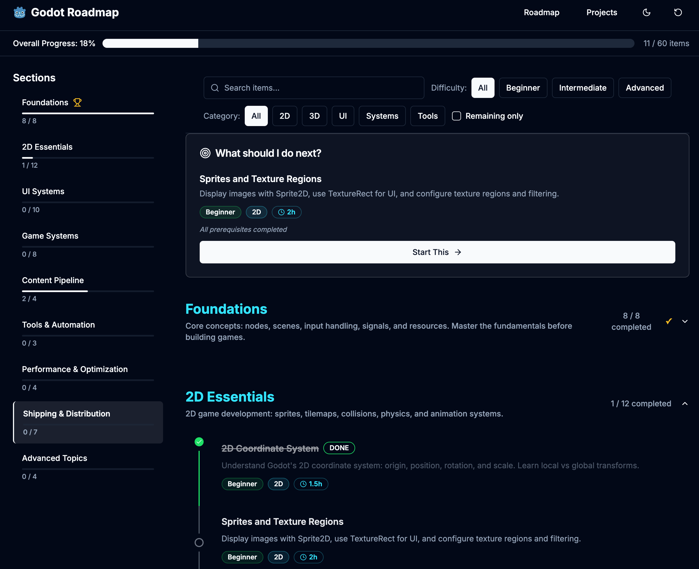

# Godot Game Developer Roadmap (2026)

A structured learning path for developers who want to *actually* get good at Godot.
Go from absolute beginner → confident game dev with **60+ curated learning items** and **7 hands-on projects**.

👉 **Live app:** [https://godot-roadmap.vercel.app/roadmap](https://godot-roadmap.vercel.app/roadmap)

✨ **Features**

* Dark mode (system + manual toggle)
* Progress tracking (saved locally)
* Filters by difficulty & category
* Fast search
* Mobile friendly

---

## Why I Built This

Godot docs are powerful… but overwhelming when you're starting out.
I wanted a **clear path** I could follow myself — and decided to share it publicly.

This roadmap focuses on:

* learning by *building*
* avoiding tutorial hell
* shipping small projects early

---

## What You'll Learn

Organized into **9 progressive sections**:

1. **Foundations**
   Nodes, scenes, input, signals, resources. Build your first playable prototype.

2. **2D Essentials**
   Sprites, tilemaps, collisions, physics, animations.

3. **UI Systems**
   Menus, HUDs, dialogs, themes, layout containers.

4. **Game Systems**
   State machines, save/load, events, data-driven design.

5. **Content Pipeline**
   Asset organization, imports, scalable project structure.

6. **Tools & Automation**
   Editor scripts, plugins, export presets.

7. **Performance & Optimization**
   Profiling, draw calls, physics optimization.

8. **Shipping & Distribution**
   Exporting, publishing to itch.io & Steam.

9. **Advanced Topics**
   Multiplayer, shaders, 3D, custom rendering.

---

## Practice Projects

7 hands-on projects that reinforce learning:

* Each maps to roadmap milestones
* Clear prerequisites
* Step-by-step checklists
* From small prototypes → real systems

---

## How to Use

1. Start with **Foundations**
2. Work sequentially
3. Mark items complete
4. Use filters + search
5. Build the projects
6. Progress saves automatically in your browser

---

## Feedback

Have ideas? Found a bug?

* Open an issue
* Or message me on Reddit / GitHub

If this helped you:

* ⭐ Star the repo
* Share it with other Godot learners
